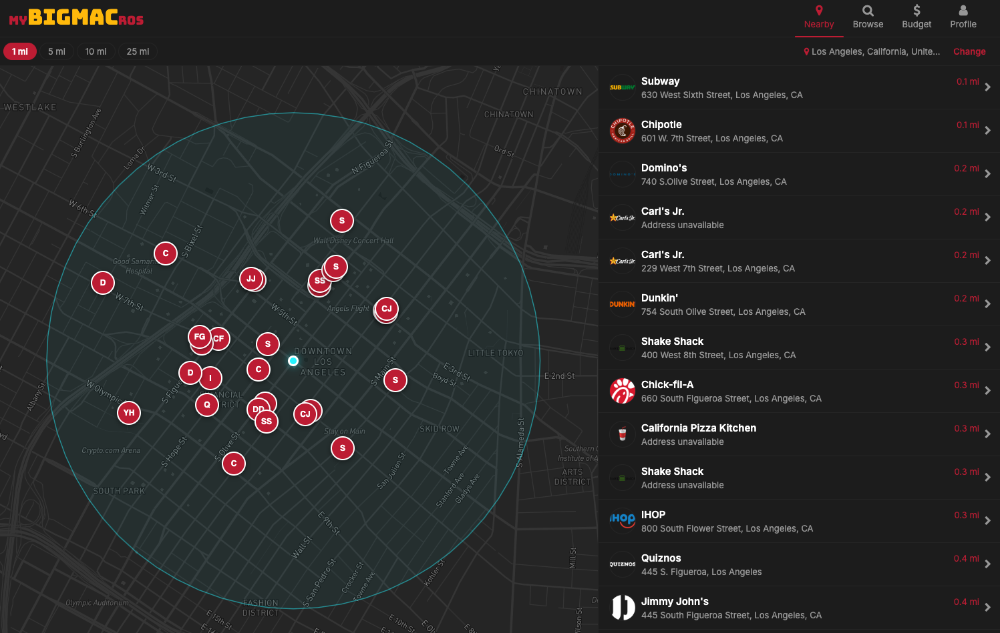
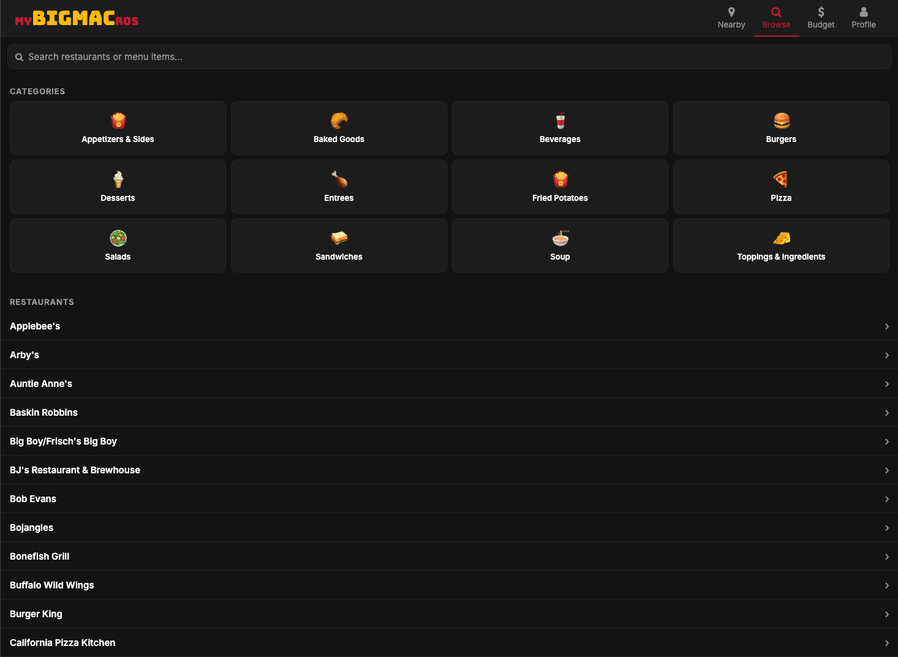
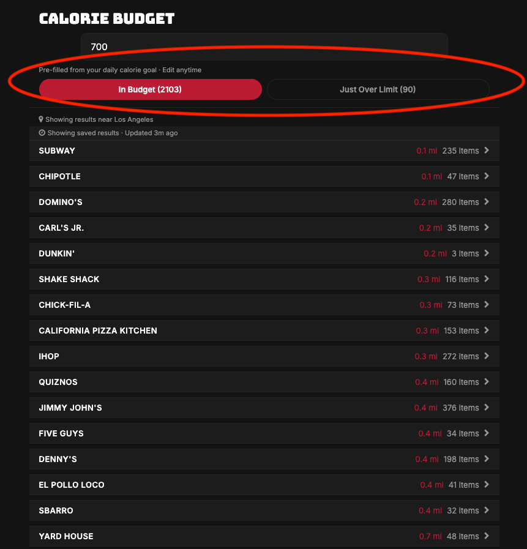
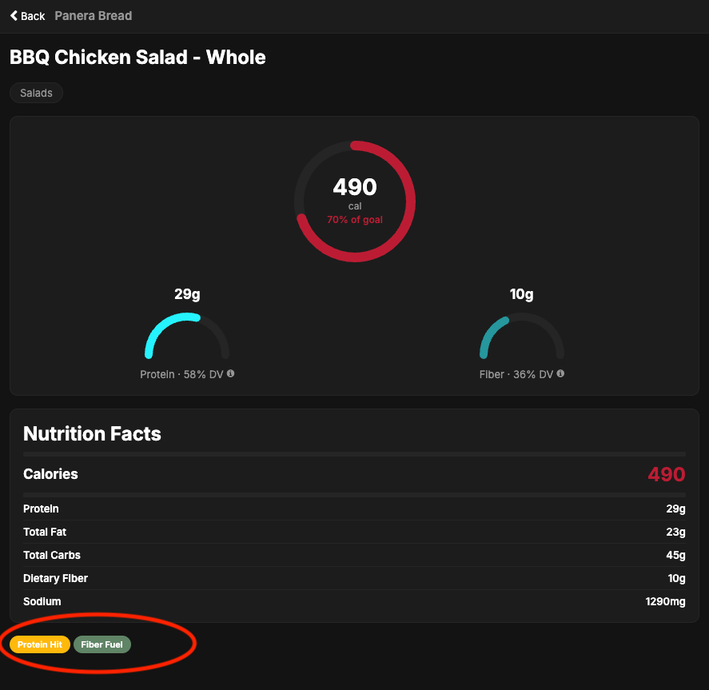

# myBigMACros

A location-based fast food nutrition tool for people who want to stay aware of what they're eating without being lectured about it.



---

## Overview

Most nutrition apps are built for people trying to avoid fast food. myBigMACros is built for people who already know what they want — it finds nearby chains, shows real nutrition data, and filters the menu down to what fits a calorie budget, with no "healthy swap" nudging.

Originally scoped as a cross-platform mobile + web app. Now web-only — Mapbox's native SDK doesn't play well with Expo's standard workflow, so mobile support was cut in favor of a solid web build. This is a solo-built project — product, design, and implementation handled end to end.

## Key Features

- **Restaurant locator** — map and list view of nearby chains via OpenStreetMap, with radius selection and a zip/address fallback
- **Nutrition browser** — real nutrition data across ~90 chains, searchable by chain or item
- **Calorie budget filter** — enter what's left for the day and see matching items across nearby restaurants, grouped by distance and calories
- **Macro-Meter** — a custom SVG visualization showing calories, protein, and fiber against daily targets
- **Protein Hit / Fiber Fuel badges** — items clearing a meaningful protein or fiber bar (under 500 calories) are flagged automatically
- **Missing data handled honestly** — incomplete nutrition data is shown as unavailable rather than defaulting to zero

## Tech Stack

| Layer | Technology |
|---|---|
| Framework | React Native (Expo) — web |
| Language | TypeScript |
| Navigation | Expo Router + React Navigation |
| Styling | NativeWind (Tailwind for React Native) |
| Server state | TanStack Query |
| Database & Auth | Supabase (PostgreSQL + Row Level Security) |
| Maps | mapbox-gl JS |
| Location Search | OpenStreetMap Overpass API |
| Fuzzy Matching | Fuse.js |
| Visualization | React Native SVG |
| Hosting | Vercel |

> Nutrition data comes from the MenuStat 2022 dataset — the most recent version available.

## Screenshots

| Restaurant Locator | Nutrition Browser |
|---|---|
|  |  |

| Calorie Budget Filter | Item Detail + Macro-Meter |
|---|---|
|  |  |

## Getting Started

Clone and run it locally:

```bash
git clone https://github.com/mraecomes/mybigmacros.git
cd mybigmacros
pnpm install
```

Create a `.env.local` file in the project root with:

```
EXPO_PUBLIC_SUPABASE_URL=
EXPO_PUBLIC_SUPABASE_ANON_KEY=
SUPABASE_SERVICE_ROLE_KEY=
EXPO_PUBLIC_MAPBOX_ACCESS_TOKEN=
EXPO_PUBLIC_APP_URL=
```

You'll need your own Supabase project ([supabase.com](https://supabase.com)) and Mapbox account ([mapbox.com](https://mapbox.com)) — copy the relevant keys into the file above. Apply the migrations in `supabase/migrations/` via the Supabase SQL editor, then download the MenuStat 2022 dataset from [menustat.org](https://www.menustat.org/data.html) and run the import script in `scripts/` to populate the database.

Then run:

```bash
pnpm expo start --web
```

The app will be running at `http://localhost:8081`.

**Requirements:** Node.js 18.18 or later, pnpm.

## Project Structure

```
app/            # Screens and routing (Expo Router)
components/     # Reusable UI components (map, nutrition, restaurant, ui)
lib/            # Supabase queries, location search, caching utilities
types/          # Shared TypeScript types
constants/      # Design tokens and app-wide constants
supabase/       # Database migrations
scripts/        # One-time data import scripts
```

## Status

Core feature set is complete. The live demo link is currently offline while I fix a location search bug (Overpass API) in the deployed build — more detail in my portfolio.

## License

All rights reserved. This code is publicly viewable for portfolio purposes but is not licensed for reuse, modification, or redistribution.

## Author

**Mallory Comes**
[LinkedIn](https://www.linkedin.com/in/malloryraecomes/) · [GitHub](https://github.com/mraecomes)